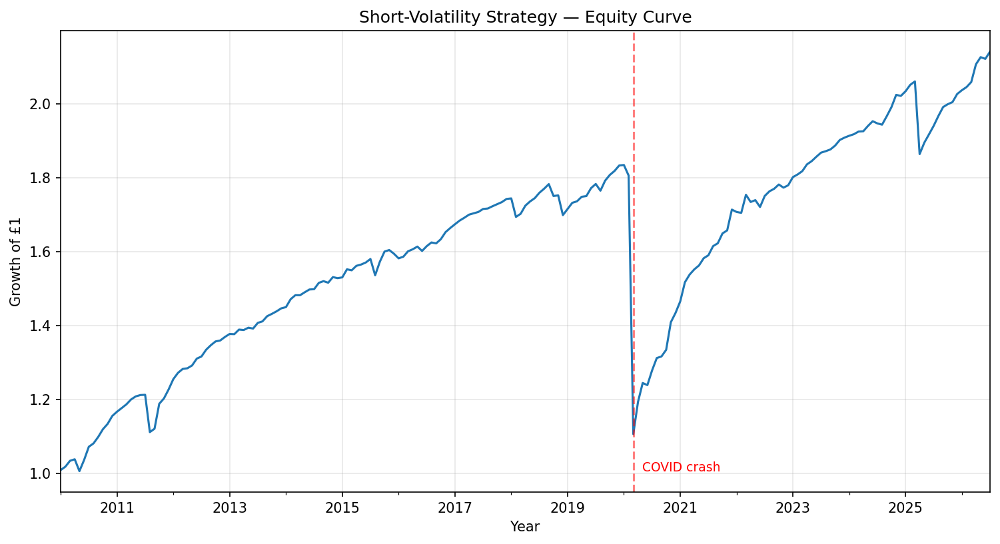

# Systematic Short-Volatility Strategy
### Harvesting the Variance Risk Premium on the S&P 500

**Python (NumPy · pandas · SciPy) · 16.5-year backtest (2010–2026)**

---

## Summary

A complete short-volatility research pipeline built from first principles: an
options pricing engine, an implied-volatility solver, and a backtest that
harvests the **variance risk premium** — the persistent gap between the
volatility options imply and the volatility that actually realises. The strategy
was profitable in **84% of months** over 16.5 years and doubled capital, while
exposing a **~40% drawdown** in the COVID crash — capturing both the edge and
the tail risk that define volatility trading.

## What I built

- **Black-Scholes pricing engine** implemented from scratch, verified against
  put-call parity to 5 decimal places.
- **Implied-volatility solver** using Brent's method to numerically invert the
  pricer; validated by round-trip recovery of a known input volatility.
- **Live volatility skew** extracted from real SPY option chains, recovering the
  equity-index downside skew and flagging deep-OTM wing instability.
- **Variance-risk-premium backtest** over 199 months, using start-of-month VIX
  against subsequently-realised variance — constructed to avoid lookahead bias.

## Key results

| Metric | Value |
|---|---|
| Months profitable | 84.4% |
| Growth of £1 | £2.14 (16.5 yrs) |
| Annualised Sharpe | 0.49 |
| Maximum drawdown | −39.7% |
| Worst month | March 2020 (COVID crash) |

## What the results mean

The premium is real and harvestable — implied volatility systematically exceeds
realised, and selling it profits in the large majority of months. But the low
Sharpe and the ~40% drawdown reveal the strategy's true character: returns are
skewed toward small steady gains and rare, severe losses. Standard deviation
understates this risk because the loss distribution is fat-tailed; **maximum
drawdown is the more honest risk measure.** Collecting premium in calm regimes
and absorbing violent losses in crises is the defining feature of
short-volatility trading.

## Limitations & next steps

Uses a variance-swap proxy (VIX² vs. realised variance) rather than a live
options portfolio, and applies a fixed position-sizing factor. Natural
extensions: dynamic sizing on the VIX term structure, a volatility-targeting
overlay to cap drawdowns, and transaction-cost modelling.

## Repo contents

- `volatility_analysis.ipynb` — full research notebook
- `equity_curve.png` — strategy equity curve

---

*Data: Yahoo Finance via `yfinance`. Built as an independent research project.*
